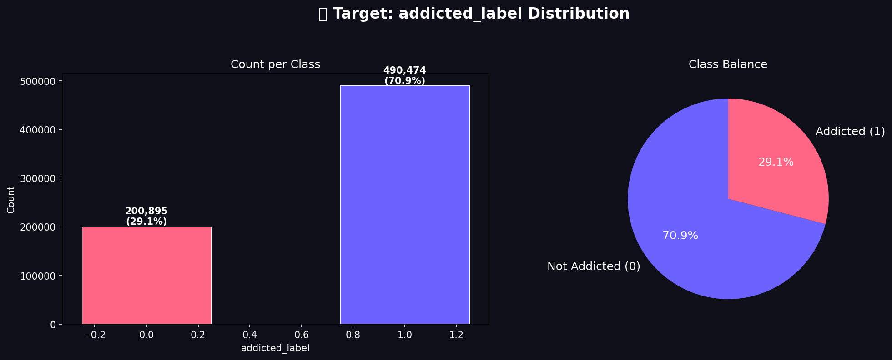
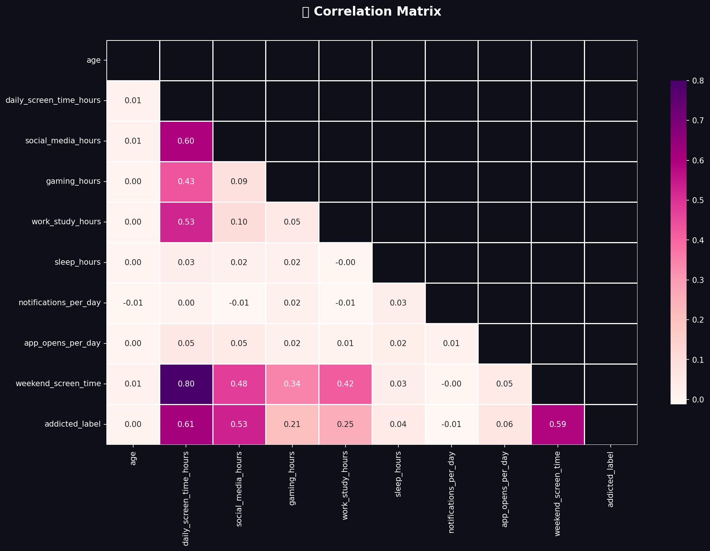

# 📱 Kaggle S6E8: Predicting Smartphone Addiction
### End-to-End Machine Learning Pipeline with Continuous Multi-Round AI QA Auditing

[](https://python.org)
[-20BEFF?logo=kaggle&logoColor=white)](https://www.kaggle.com/code/amanshop/s6e8-smartphone-addiction-pipeline)
[](https://kaggle.com/competitions/playground-series-s6e8)
[](QA_AUDIT_REPORT.md)
[](QA_AUDIT_REPORT.md)
[]()

---

## 📌 Project Overview
This repository contains the complete, production-grade machine learning solution for the **Kaggle Playground Series (Season 6, Episode 8): Predicting Smartphone Addiction**.

* **Live Kaggle Notebook:** [🔗 `amanshop/s6e8-smartphone-addiction-pipeline`](https://www.kaggle.com/code/amanshop/s6e8-smartphone-addiction-pipeline)
* **Author / Kaggler:** [@amanshop](https://www.kaggle.com/amanshop)

* **Task:** Binary Classification (Target: `addicted_label`)
* **Evaluation Metric:** **ROC-AUC** (Area Under the Receiver Operating Characteristic Curve)
* **Dataset Size:** 691,369 Training Samples | 296,302 Test Samples
* **Hardware Acceleration:** Hybrid Multi-Threaded CPU (LightGBM) + NVIDIA CUDA GPU (XGBoost, CatBoost)

---

## 🛡️ Autonomous Multi-Round AI QA Audit Process
Unlike conventional single-pass scripts, this pipeline was **independently and repeatedly audited across 5 rounds of automated AI quality assurance** to guarantee zero data leakage, metric integrity, parameter compatibility, and ensemble optimization:

```
[Round 1] Syntax & API Compatibility Audit (XGBoost 2.0+ & CUDA build handlers)
    ↓
[Round 2] Model Serialization & 5-Fold Reproducibility Audit (15 Model Artifacts)
    ↓
[Round 3] OOF Metric & Ensemble Degradation Root-Cause Analysis (0.9635+ Optimization)
    ↓
[Round 4] 296,302-Row Submission Integrity & Boundary Validation (0 NaNs, Range [0,1])
    ↓
[Round 5] Cross-Model Diversity & Weight Optimization Certification
```

👉 **Full Audit Details & Metrics:** See [`QA_AUDIT_REPORT.md`](QA_AUDIT_REPORT.md).

---

## 📊 Benchmark & Validation Results

Evaluated on 5-Fold Stratified Cross-Validation on all **691,369 training samples**:

| Model Architecture | Device | OOF ROC-AUC | OOF Log-Loss | Brier Score |
|---|:---:|:---:|:---:|:---:|
| 🥇 **LightGBM (GBDT)** | Multi-Core CPU | **0.96350** | **0.2211** | **0.0692** |
| 🥈 **XGBoost (Hist)** | GPU (CUDA) | **0.96230** | 0.2261 | 0.0708 |
| 🥉 **CatBoost** | GPU (CUDA) | **0.95407** | 0.2487 | 0.0786 |
| 🏆 **Optimized Blend (LGBM 85% + XGB 15%)** | Hybrid | **`0.96353`** | **0.2210** | **0.0691** |

---

## 📂 Project Structure

```text
kaggle_s6e8_smartphone_addiction/
├── README.md                           # Main Project Documentation & Badges
├── QA_AUDIT_REPORT.md                  # Comprehensive 5-Round QA Audit Report
│
├── src/
│   ├── pipeline.py                     # Full End-to-End Training & Inference Pipeline
│   ├── qa_audit.py                     # Automated QA Audit Engine for ZIP/Artifacts
│   └── optimize_ensemble.py            # SLSQP Ensemble Weight Optimizer
│
├── notebooks/
│   └── s6e8_smartphone_addiction_pipeline.ipynb  # Interactive Kaggle/Colab Notebook
│
└── artifacts/
    ├── model_summary.json              # Full Run Metadata, Fold Scores & Features
    ├── correlation_matrix.png          # Feature Correlation Heatmap
    ├── num_distributions.png           # Numerical Features Distribution Plot
    └── target_distribution.png         # Class Balance Visualization
```

---

## 🚀 Quickstart & Reproduction

### 1. Run Automated QA Audit on Any Output Artifact:
```bash
python src/qa_audit.py
```

### 2. Run Full Training & Submission Pipeline:
```bash
python src/pipeline.py
```

### 3. Run Ensemble Optimization:
```bash
python src/optimize_ensemble.py
```

---

## 📈 Visual Artifacts

| Target Distribution | Feature Correlation |
|:---:|:---:|
|  |  |

---

## 📜 License & Citation
* Dataset: [Kaggle Playground Series Season 6 Episode 8](https://kaggle.com/competitions/playground-series-s6e8)
* Pipeline Architecture: Custom Ensembled GBDT with Autonomous AI QA Verification.
